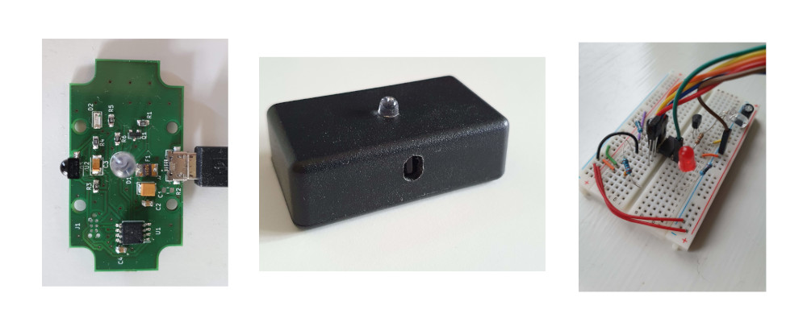
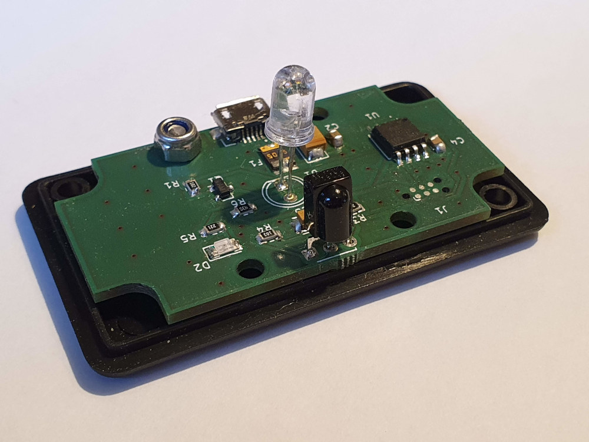

# Sonos Magic Hub

This project contains firmware and hardware design files for using the LG Magic Remote that comes with LG OLED C9 TV with a Sonos Playbar. Sonos Playbar already has support for universal remotes, but the LG Magic Remote sends one set of codes when the TV is on and another set when the TV is off. So controlling the volume up, down and mute works fine when the TV is on, but not when it is off. It's not clear why LG has done it this way, but probably it is for controlling other LG devices.

Instead of waiting for LG to fix this I created a small circuit to translate the IR codes.

Note: there are various forum posts about the reverse problem for LG OLED CX. Apparently the Sonos Playbar can only be controlled by the LG remote when TV is off. This project doesn't solve that.

## How does it work?

This is straightforward: when a IR signal is received it will be converted to a code that the Sonos Playbar understands.

## List of IR codes

The table shows the IR codes sent by the remote when it is configured to send Philips RC6 codes as described here: https://support.sonos.com/s/article/3479?language=en

| Command     | IR code (TV off)         | IR code (TV on)    |
|-------------|--------------------------|--------------------|
| Volume up   | NEC, 20DF40BF, 32 bits   | RC6, 1010, 20 bits |
| Volume down | NEC, 20DFC03F, 32 bits   | RC6, 1011, 20 bits |
| Mute        | NEC, 0DF906F, 32 bits    | RC6, 100D, 20 bits |

## How to build the firmware

Use the Arduino IDE and install the ATTinyCore (https://github.com/SpenceKonde/ATTinyCore). Do this from Boards Manager in the IDE. Select "ATtiny 25/45/85" under boards and clock to 8 MHz (internal). For uploading the firmware I have used USBasp with Tag-Connect, but you can you use any way you prefer. Remember to burn the bootloader before uploading the firmware.

## Various notes

* Use this at your own risk! In the firmware I included support for NEC repeat code that the remote sends if one of the buttons are held down. There is a limit of 5 repeats in a row to avoid ramping up the volume too fast.
* There is no USB enumeration and thereby it is not according to the USB specifications. Still I think it should work fine with most USB hosts.
* It was unclear if the shield of the USB connector should be connected to GND or not. That is why I included R2. I left it unpopulated.
* The fuse (F1) is probably not needed. Maybe it should have some TVS diodes instead to suppress ESD.
* The IR library is from https://gist.github.com/SeeJayDee/caa9b5cc29246df44e45b8e7d1b1cdc5

## BOM

|Ref|Value         |Footprint                                                                 |
|---|--------------|--------------------------------------------------------------------------|
|C1 |10 uF         |Capacitor_Tantalum_SMD:CP_EIA-3528-12_Kemet-T_Pad1.50x2.35mm_HandSolder   |
|C2 |1 uF          |Capacitor_SMD:C_0805_2012Metric_Pad1.15x1.40mm_HandSolder                 |
|C3 |0.1 uF        |Capacitor_Tantalum_SMD:CP_EIA-3528-12_Kemet-T_Pad1.50x2.35mm_HandSolder   |
|C4 |0.1 uF        |Capacitor_SMD:C_0805_2012Metric_Pad1.15x1.40mm_HandSolder                 |
|D1 |LD271         |LED_THT:LED_D5.0mm_IRGrey                                                 |
|D2 |LED           |LED_SMD:LED_1206_3216Metric                                               |
|F1 |Polyfuse_Small|FUSM1812X02:FUSM1812X02                                                   |
|J1 |AVR-ISP-6     |(No actual part) Connector:Tag-Connect_TC2030-IDC-NL_2x03_P1.27mm_Vertical|
|J2 |629105136821  |(Micro USB connector) WE_629105136821:WE_629105136821                     |
|Q1 |MMBT3904      |Package_TO_SOT_SMD:SOT-23                                                 |
|R1 |1K            |Resistor_SMD:R_0805_2012Metric_Pad1.15x1.40mm_HandSolder                  |
|R2 |0             |Resistor_SMD:R_0805_2012Metric_Pad1.15x1.40mm_HandSolder                  |
|R3 |220           |Resistor_SMD:R_0805_2012Metric_Pad1.15x1.40mm_HandSolder                  |
|R4 |10K           |Resistor_SMD:R_0805_2012Metric_Pad1.15x1.40mm_HandSolder                  |
|R5 |220           |Resistor_SMD:R_0805_2012Metric_Pad1.15x1.40mm_HandSolder                  |
|R6 |35            |Resistor_SMD:R_0805_2012Metric_Pad1.15x1.40mm_HandSolder                  |
|U1 |ATtiny85V-10SU|Package_SO:SOIJ-8_5.3x5.3mm_P1.27mm                                       |
|U2 |TSOP38238     |OptoDevice:Vishay_MINICAST-3Pin                                           |

The PCB fits inside the Hammond 1551H (http://www.hammondmfg.com/pdf/1551H.pdf).
